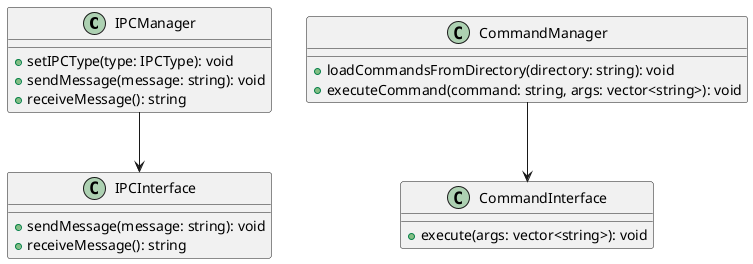
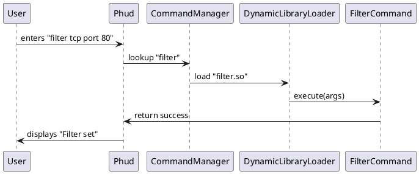

# IPC & Command Execution Libraries - API Specification

## Overview
This document defines the API specifications for the IPC Selection & Configuration Library and the Command Execution Library. It includes descriptions of classes, methods, and their expected behaviors.

---

## 1️⃣ IPC Library API Specification

### **Class: `IPCManager`**
#### **Description:**
Handles the selection, configuration, and communication of various IPC mechanisms.

#### **Methods:**
```cpp
void setIPCType(IPCType type);
```
- **Description:** Selects the IPC mechanism.
- **Parameters:**
  - `IPCType type` - The IPC mechanism (e.g., `SHARED_MEMORY`, `SOCKETS`).
- **Returns:** `void`

```cpp
void sendMessage(const std::string& message);
```
- **Description:** Sends a message using the selected IPC method.
- **Parameters:**
  - `message` - The message to send.
- **Returns:** `void`

```cpp
std::string receiveMessage();
```
- **Description:** Receives a message using the active IPC method.
- **Returns:** `std::string` - The received message.

---

### **Class: `IPCFactory`**
#### **Description:**
Factory class responsible for instantiating the appropriate IPC communication object.

#### **Methods:**
```cpp
static std::unique_ptr<IPCInterface> createIPC(IPCType type);
```
- **Description:** Creates an IPC instance based on the selected type.
- **Parameters:**
  - `IPCType type` - The IPC mechanism (e.g., `SOCKETS`, `SHARED_MEMORY`).
- **Returns:** A unique pointer to an `IPCInterface` instance.

---

### **Interface: `IPCInterface`**
#### **Description:**
Defines a generic interface for all IPC mechanisms.

#### **Methods:**
```cpp
virtual void sendMessage(const std::string& message) = 0;
```
- **Description:** Sends a message over the IPC method.
- **Returns:** `void`

```cpp
virtual std::string receiveMessage() = 0;
```
- **Description:** Receives a message over the IPC method.
- **Returns:** `std::string`

---

## 2️⃣ Command Execution Library API Specification

### **Class: `CommandManager`**
#### **Description:**
Handles dynamic loading and execution of user-defined commands.

#### **Methods:**
```cpp
void loadCommandsFromDirectory(const std::string& directory);
```
- **Description:** Loads `.so` command plugins from a specified directory.
- **Parameters:**
  - `directory` - Path to the directory containing command plugins.
- **Returns:** `void`

```cpp
void executeCommand(const std::string& command, const std::vector<std::string>& args);
```
- **Description:** Executes a user-defined command by dynamically loading the corresponding `.so` file.
- **Parameters:**
  - `command` - The name of the command.
  - `args` - A vector of command arguments.
- **Returns:** `void`

---

### **Interface: `CommandInterface`**
#### **Description:**
Defines a standard interface for user-defined commands.

#### **Methods:**
```cpp
virtual void execute(const std::vector<std::string>& args) = 0;
```
- **Description:** Executes the command with the given arguments.
- **Parameters:**
  - `args` - A vector of command arguments.
- **Returns:** `void`

---

## 3️⃣ IPC & Command System Interactions
- `phud` will use `CommandManager` to handle commands.
- Commands will interact with `IPCManager` to send/receive data.
- The system will support **multiple IPC methods** selectable at runtime.
- The command system will be **entirely dynamic**, allowing easy extension.

---

## 4️⃣ UML Diagrams (`.puml` Format)

### **Class Diagram**


### **Sequence Diagram - Command Execution**


---

## 5️⃣ Test-Driven Development Setup
- Use **Catch2** for unit testing.
- Use **Makefile-based TDD setup**.
- Write **unit tests before implementation**.

💡 **Example Catch2 Test for IPCManager**:
```cpp
#define CATCH_CONFIG_MAIN
#include <catch2/catch.hpp>
#include "IPCManager.h"

TEST_CASE("IPCManager selects IPC type", "[IPC]") {
    IPCManager ipc;
    ipc.setIPCType(IPCType::SOCKETS);
    REQUIRE(ipc.getCurrentIPCType() == IPCType::SOCKETS);
}
```

---

# **Next Steps**
✅ Review and refine API definitions.
✅ Generate `.puml` diagrams as standalone files.
✅ Set up a Git repo and TDD framework.

🚀 **Feedback? Are we aligned?**

